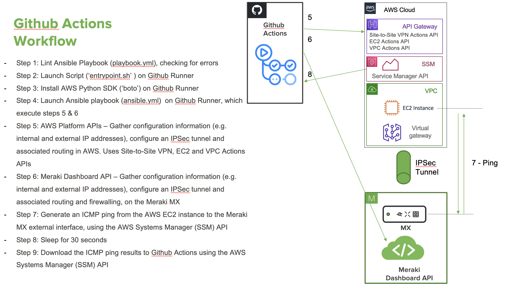

# Introduction

This project provides a simple example of using tools traditionally used for software development and applying them in the context of networking. The objective is to provide an environment where changes can be made across your IT environment in an agile manner, where your network’s configuration changes operational status is automatically evaluated and changes orchestrated between various networking and software componants.

This project uses the following tools:

* Github Actions
* Ansible
* Meraki MX Appliance
* AWS EC2 instance

The project shall configure IPSec based connectivty between a Meraki MX appliance and an Amazon EC2 instance (via an AWS Virtual Gateway in the VPC). The connectivity shall be firewalled at the MX end, the configuration of which shall be controlled as part of the repo. Changes to the repo (specifically, the "config.yml" and "playbook.yaml" files) shall automatically trigger the following Github Actions:

* lint the repo
* push the configuration changes out
* carry out a simple connectivity test using ping

The key reasons to control networks in this manner is to enable:
* Automate testing such as syntax checking / linting
* Tracking
  * Who made changes and when
  * Differences in configurations
  * State at points in time
* Rollback failed changes
* Integrate the control of software changes with the control of the network upon which they rely

# Tools overview
## Github Actions
GitHub Actions help you automate tasks within your development life cycle. GitHub Actions are event-driven, meaning that you can run a series of commands after a specified event has occurred. In this project, we'll be triggering Actions when somebody pushes an update to our configuration files ("config.yaml" or "playbook.yml"). This event will trigger the actions defined in ".github/workflows/main.yml". The key operations Githib Actions takes are:

* Starts our Actions Job with the runner - this is a Github hosted server, we're using Ubuntu. The runner exectures our steps:
* checks-out our repo - this enables our workflow to access it
* lints our ansible playbook - checks playbooks for practices and behavior that could potentially be improved
* executes the bash script defined at sh ./scripts/entrypoint.sh. It also passes to the script a number of "secrets" - these are defined under the repo Settings -> Secrets
### Bash Script
* the script defined at ./scripts/entrypoint.sh sets up our runner's server enviroinment - installing the AWS Python SDK (boto3/botocore). Once this has completed it launces our Ansible Playbook ('playbook.yml'), and passes it the environment variables that we passed above.
* Our Ansible Playbook walks through a number of steps that gathers configuration information from both the Meraki and AWS EC2 environments (via API calls to both services), and uses this information to create an IPSec tunnel from a Meraki MX appliance, to an AWS Virtual Gateway. This includes creating the relevant routing at both ends, and creating a firewall configuration at the Meraki side, the rules for which are defined in "playbooks/config.yaml"
### Connectivity test
* At this point we should have connectivity from our MX Appliance to the AWS EC2 instance. We can carry out a simple connectivoty test by launcing a ping from our EC2 instance to the public IP of the MX appliance. This uses the AWS Systems Manager Agent (SSM Agent). After a short pause for the command to execute, we use SSM again to recover the result.
* All steps above can be monitored using the 'Actions' tab. The image below shows a successful ping to the external MX address at the "aws ssm get-command-invocation" job:

# Usage

To use this workflow, simply fork this repo and configure for your own environment using the "config.yml" file and the Secrets (described below).

# Operation

The high level operation of the Github Actions are described in the diagram below:

## Secrets
Confidential details such as API keys should be passed to your Actions Workflow via the 'Secrets' function. This is accessible via Settings->Secrets and should be configured as follows:

The secrets are updated as shown below, in this example the Meraki API key.

Once the Secrets are configured, they are passed to our workflow and into our Ansible Playbook via environment variables. The following extract from "main.yml" shows the secrets being passed to "entrypoint.sh" as environement variables:

Within "entrypoint.sh", the secrets are futher passed to ansible as we launch the playbook, with the following command:

    ansible-playbook playbook.yml --extra-vars "MERAKI_API_KEY=$MERAKI_API_KEY AWS_ACCESS_KEY_ID=$AWS_ACCESS_KEY_ID AWS_SECRET_ACCESS_KEY=$AWS_SECRET_ACCESS_KEY PSK=$PSK RTID=$RTID AWS_REGION=$AWS_REGION AWS_GATEWAY_ID=$AWS_GATEWAY_ID"

The format of the secrets is as follows:

Secret| Format | notes
------------ | ------------- | -------------------
AWS_ACCESS_KEY_ID | 208ZW1NH6X4G6ZRH62C3 |
AWS_GATEWAY_ID | vgw-7nulnyegucu9q3692h0d | Virtual Private Gateway
AWS_REGION | eu-west-1 | 
AWS_SECRET_ACCESS_KEY | BhdcqNDnvCnqcaSb4bjnspwDzb8Rv2keu7+CMytB| 
INSTANCE_IDS | i-0a4j05i2hf5020wxke | AWS EC2 Instance ID
MERAKIAPI | 400d1de3f36caed4bdb91b7cbaba1950f0d7827d | Meraki Dashboard API key
PSK | VH19rDeWT_wne543217nx3mri8g4sv6Q | Preshared key for IPSec Tunnel
RTID | rtb-fb6f1234 | AWS Route Table ID

## Requirements

### Meraki
* Any MX Security Appliance.
* Instructions for generating a Meraki Dashboard API key: https://developer.cisco.com/meraki/build/meraki-postman-collection-getting-started/

Open your Meraki dashboard: https://dashboard.meraki.com
Once logged in, navigate to the Organization Settings menu.
Ensure that the API Access is set to “Enable access to the Cisco Meraki Dashboard API”

### Amazon Web Services
* Single EC2 instance running, with SSM agent installed. SSM comes preinstalled in some Amazon Machine Images https://docs.aws.amazon.com/systems-manager/latest/userguide/ssm-agent.html
SSM is automatically installed when launching an Ubuntu server:

* AWS Access Key and Secret Access Key can be found by signing into your AWS console as an IAM user, then navigate to your user name in the upper right section of the navigation bar. From the drop-down menu, select My Security Credentials, as shown in Figure: https://aws.amazon.com/blogs/security/how-to-find-update-access-keys-password-mfa-aws-management-console/

AWS_REGION is selected at the top right hand side. In the screenshot above this is selected as 'Ohio', which translates to 'us-east-2' in the drop down menu. EC2/VPCs using the 'Ohio' region should populate AWS_REGION with 'us-east-2'.

* INSTANCE_IDS
is the EC2 instance ID, found under the 'EC2->Instances" menu:

* AWS_GATEWAY_ID (="Internet Gateway") and RTID (=Route Table ID") can be found in the VPC Service section

### Other
* PSK - the Preshared key used in the IPSec Tunnel can be generated at random.

 
