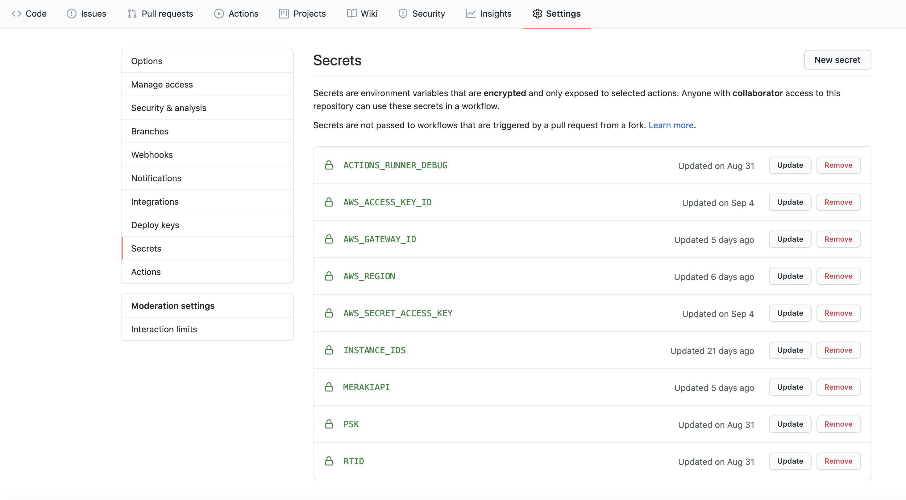

# Introduction

This project provides a simple example of using tools traditinally used for software development and applying them in the context of networking. The objective is to provide an environment where changes can be made across your IT environment in an agile manner, where your network’s configuration changes operational status is automatically evaluated and changes orechestrated between various networking and software componants.

This project uses the following tools:

* Github Actions
* Ansible
* Meraki MX Appliance
* AWS EC2 instance

The project shall configure IPSec based connectivty between a Meraki MX appliance and an Amazon EC2 instance. The connectivoty shall be firewalled at the MX end, the configuration of which shall be controlled as part of the repo - any changes to the repo shall automatically 

* lint the repo
* push the configuration changes out
* carry out a simple connectivity test using ping

# Tools overview
## Github Actions
GitHub Actions help you automate tasks within your development life cycle. GitHub Actions are event-driven, meaning that you can run a series of commands after a specified event has occurred. In this project, we'll be triggering Actions when somebody pushes an update to our configuration files ("config.yaml" or "playbook.yml"). This event will trigger the actions defined in ".github/workflows/main.yml". The key operations Githib Actions takes are:

* Starts our Actions Job with the runner - this is a Github hosted server, we're using Ubuntu. The runner exectures our steps:
* checks-out our repo - this enables our workflow to access it
* lints our ansible playbook - checks playbooks for practices and behavior that could potentially be improved
* executes the bash script defined at sh ./scripts/entrypoint.sh. It also passes to the script a number of "secrets" - these are defined under the repo Settings -> Secrets
* the script defined at ./scripts/entrypoint.sh sets up our runner's server enviroinment - installing the AWS Python SDK, 'boto'. Once this has completed it launces our Ansible Playbook ('playbook.yml'), and passes it the environment variables that we passed above.
* Our Ansibel Playbook walks through a number of steps that gathers configuration information from both the Meraki and AW EC2 environments (via PAI calls to both services), and uses this information to create an IPSec tunnel from a Meraki MX appliance, to an AWS Virtual Gateway. This includes creating the relevant routing at both ends, and creating a firewall configuration at the Meraki side, the rules for which are defined in "playbooks/config.yaml"
* At this point we should have connectivity from our MX Appliance to the AWS EC2 instance. We can carry out a simple connectivoty test by launcing a ling from our ECS instance to the public IP of the MX appliance. This uses the AWS Systems Manager Agent (SSM Agent). After a short pause for the command to execute, we use SSM again to recover the result.
* All steps above can be monitored using the 'Actions' The image below shows a successful ping to the external MX address at the "aws ssm get-command-invocation" job:

## Workflow

# Secrets
Confidential details such as API keys should be passed to your Actions Workflow via the 'Secrets' function. This is accessible via Settings->Secrets and should be configured as follows:

The format of the secrets is as follows:

list item 1
list item 2
## header 2

### header 3
    Highlighted text

### header 3
    more highlighted text
 

# Create a file "credentials.ini" with the following contents:

[camera]

#comment

some delimited text = \*\*rtsp:\/\/\<camera IP>/live\*\*
    
#e.g.host = rtsp://192.168.127.29:9000/live

## Launch the script:

    $python3 MV_OpenCV.py
## link to local .png

